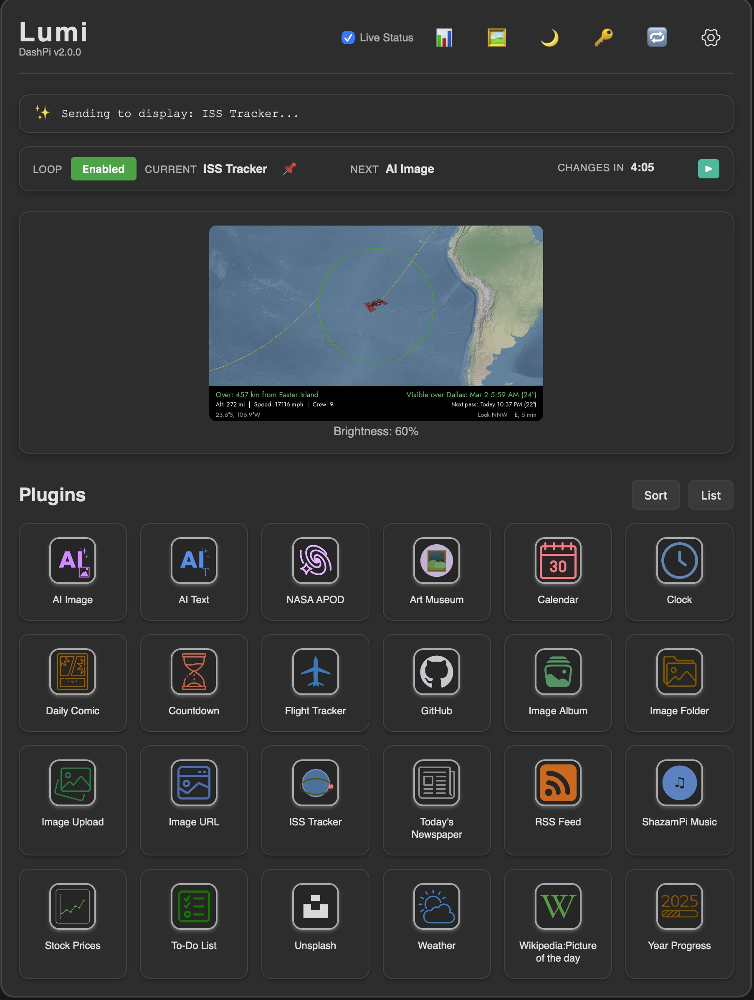
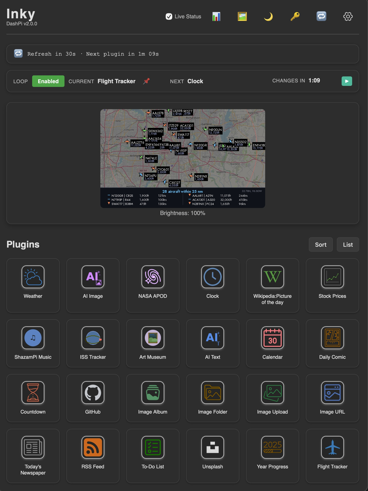

# Minkipi

## About Minkipi

Minkipi is an open-source, customizable smart display powered by a Raspberry Pi. It supports **multiple display types** with automatic hardware detection — just install and boot, and Minkipi figures out the rest.

| Display Type | What You Get |
|---|---|
| **LCD** (e.g. Waveshare 7" HDMI IPS) | Full-color, fast refresh, touch-capable, backlight with brightness scheduling |
| **E-Ink** (Pimoroni Inky) | Paper-like aesthetic, no glare, ultra-low power, auto-detected via Inky library |
| **E-Ink** (Waveshare e-Paper) | Wide range of sizes and color options, including bi-color (black/red) displays |

All display types share the same plugin ecosystem, web UI, and configuration — only the rendering differs. Minkipi auto-detects your hardware on first boot and adapts accordingly.

**Features**:
- **Auto-detection**: Plug in any supported display and Minkipi configures itself
- **Web Interface**: Configure the display, manage plugins, and set up loops from any device on your network
- **24 built-in plugins**: Weather, clocks, AI-generated images, news, stocks, art museum, ISS tracker, and more
- **Scheduled loops**: Display different plugins at different times of day
- **Multi-device friendly**: Run multiple Minkipi devices on the same network, each with its own name and settings (accessible via `hostname.local`)
- **Self-update**: Check for and apply updates directly from the web UI
- **Open source**: Modify, customize, and create your own plugins

**Plugins include**: Weather, Clock, AI Image, AI Text, NASA APOD, Art Museum, Stocks, ISS Tracker, Flight Tracker, ShazamPi, Calendar, Newspaper, Comics, RSS, Image Upload, Image Album, Image URL, Countdown, GitHub, To-Do List, Unsplash, Year Progress, Wikipedia POTD, and more.

For documentation on building custom plugins, see [Building Plugins](./docs/building_plugins.md).

## Screenshots

| Web UI (LCD) | Web UI (E-Ink) |
|---|---|
|  |  |

## Hardware

- Raspberry Pi (4 | 3 | Zero 2 W)
- MicroSD Card (min 8 GB)
- One of the following displays:
    - **LCD**: Waveshare 7" 1024x600 HDMI IPS Display (touch supported)
    - **Inky e-Paper**: Pimoroni Inky Impression (13.3", 7.3", 5.7", 4") or Inky wHAT (4.2")
    - **Waveshare e-Paper**: Spectra 6, Black and White, bi-color, various sizes
        - Note: IT8951-based displays are not supported

## Installation

**Quick install** (one command):
```bash
curl -sSL https://raw.githubusercontent.com/SHagler2/Minkipi/main/install/bootstrap.sh | sudo bash
```

**Or step by step:**

1. Install git (if not already installed):
    ```bash
    sudo apt-get update && sudo apt-get install -y git
    ```
2. Clone the repository:
    ```bash
    git clone https://github.com/SHagler2/Minkipi.git
    ```
3. Navigate to the project directory:
    ```bash
    cd Minkipi
    ```
4. Run the installation script with sudo:
    ```bash
    sudo bash install/install.sh
    ```

After the installation is complete, the script will prompt you to reboot your Raspberry Pi. Once rebooted, Minkipi will auto-detect your display and show the startup screen.

**Note**: The installation script requires sudo privileges. We recommend starting with a fresh installation of Raspberry Pi OS. The installer automatically enables SPI and I2C interfaces, expands swap on low-memory devices (Pi Zero), and handles all dependencies.

**Pi Zero users**: Installation takes longer on low-memory devices (15-20 minutes). The installer automatically manages swap and installs packages in batches to avoid out-of-memory issues.

## Update

Minkipi can be updated directly from the **Settings** page in the web UI — just click "Check for Updates."

Or update manually:
```bash
cd Minkipi
git pull
sudo bash install/install.sh
```

## Uninstall

```bash
sudo bash install/uninstall.sh
```

## Upgrading From Earlier Versions

Minkipi v2.0 introduced unified multi-display support in a single codebase. Your e-ink hardware is fully supported, and existing plugins, loops, and API keys can be migrated by copying your `device.json` config and `.env` file to the new installation.

## License

Distributed under the GPL 3.0 License, see [LICENSE](./LICENSE) for more information.

This project includes fonts and icons with separate licensing and attribution requirements. See [Attribution](./docs/attribution.md) for details.

## Acknowledgements

Minkipi is based on the original project by fatihak.
